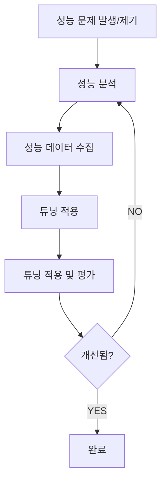

# Part 18. Oracle 성능분석 기본방법론 요약

> 📖 출처: Oracle SQL 실전 튜닝 나침반 (Part 18, pp.725-803)
> 📝 정리: 루나 (2026-03-16)

---

## 목차

<<<<<<< HEAD
1. [Section 01. 성능분석 방법론 개요](#section-01-성능분석-방법론-개요)
2. [Section 02. 핵심 성능 데이터 이해](#section-02-핵심-성능-데이터-이해)
3. [Section 03. 성능 분석 유틸리티](#section-03-성능-분석-유틸리티)
4. [Section 04. 기본적 성능 분석](#section-04-기본적-성능-분석)

---

## Section 01. 성능분석 방법론 개요

### 성능 분석 프로세스 플로우


### 성능 분석 도구
| 도구 | 설명 | 용도 |
|------|------|------|
| **Dynamic Performance View** | 실시간 Database 성능 모니터링 | 현재 상태 파악 |
| **AWR** | Automatic Workload Repository | 성능 통계 자동 수집/보관 |
| **ASH** | Active Session History | 활성 SESSION 캡처 |
| **ADDM** | Automatic Database Diagnostic Monitor | AWR 데이터 분석으로 권장사항 제공 |
| **사용자 정의 스크립트** | DBA 맞춤형 분석 도구 | 특정 상황 분석 |

### 성능분석 로드맵

1. **Database 기본 성능 분석**
   - DB 전반적인 성능 지표 수집
   
2. **성능 문제 위치 파악**
   - Database vs OS Level 문제인지 판단
   
3. **분기 분석**
   - **OS 서버 성능 부하 분석**: OS Level 문제일 경우
   - **SQL 시간 구간 성능 비교 분석**: DB Level 문제일 경우
   
4. **상세 분석**
   - **특정 SQL 분석**: SQL 성능 문제 확인
   - **WAIT EVENT 분석**: 특정 SQL이 아닌 경우
   
5. **하드웨어/인프라 분석**

### 성능 튜닝 목표

#### 주요 목표
| 목표 | 설명 |
|------|------|
| **응답시간 최소화** | 쿼리/트랜잭션 완료 시간 단축 |
| **처리량 최대화** | 단위 시간당 트랜잭션/작업 수 증대 |
| **리소스 효율적 사용** | CPU, 메모리, 디스크 I/O 최적화 |
| **잠금 경합 감소** | 동시성 향상 |
| **SQL 실행 계획 최적화** | 최소 리소스로 처리 |
| **디스크 I/O 효율화** | I/O 작업 최소화 |
| **확장성 대비** | 향후 워크로드 증가 대응 |
| **대기 이벤트 효율화** | 병목 현상 방지 |
| **DML 오버헤드 최소화** | Redo/Undo 생성량 최적화 |
=======
| Section | 제목 | 바로가기 |
|---------|------|---------|
| 01 | 성능 분석 방법론 개요 | [→](#section-01-성능-분석-방법론-개요) |
| 02 | 핵심 성능 데이터 이해 | [→](#section-02-핵심-성능-데이터-이해) |
| 03 | 성능 분석 유틸리티 | [→](#section-03-성능-분석-유틸리티) |
| 04 | 기본적 성능 분석 | [→](#section-04-기본적-성능-분석) |

---

## Section 01. 성능 분석 방법론 개요

### 성능 분석 및 튜닝 흐름도

> 📊 **성능 분석 흐름도**: 성능문제 발생 → 성능분석(Dynamic View/AWR/ASH/ADDM) → 성능튜닝 → 적용 및 평가

| 단계 | 설명 |
|------|------|
| ① 성능 문제 발생/제기 | 시스템 내 성능 문제 존재를 인식 |
| ② 성능 분석 | Dynamic Performance View, AWR, ASH, ADDM 활용 |
| ③ 성능 튜닝 | 분석을 통해 식별된 문제에 대한 개선 방법 적용 |
| ④ 튜닝 적용 및 평가 | 변경 적용 후 성능 모니터링 및 개선 확인 |

### 성능 분석 로드맵

> 📊 **성능 분석 로드맵**: 성능문제 → DB 기본분석 → 문제위치(DB vs OS) → SQL 분석 → WAIT EVENT → 튜닝 적용

**분석 흐름:**
1. **성능 문제 발생** → Database 기본 성능 분석
2. **문제 위치 파악** → Database인지 OS Level인지 판별
3. **SQL 성능 분석** → 정상 구간과 문제 구간의 SQL CPU_TIME, 실행시간, I/O 비교
4. **특정 SQL에 의한 문제?** → YES: SQL 튜닝 / NO: WAIT EVENT 분석
5. **WAIT EVENT 분석** → 특정 SQL? 하드웨어 이상? 인프라 분석?
6. **최종 분석 결과 도출** → 튜닝 및 적용

### 성능 튜닝 목표

- **응답 시간 최소화**: 쿼리 및 트랜잭션 완료 시간 단축
- **처리량 최대화**: 단위 시간당 처리 가능한 트랜잭션 수 증가
- **리소스 효율적 사용**: CPU, 메모리, 디스크 I/O 최적화
- **잠금 경합 감소**: 다중 사용자 환경에서 동시성 향상
- **SQL 실행 계획 최적화**: 최소 리소스로 쿼리 처리
- **디스크 I/O 효율화**: 메모리보다 느린 I/O 작업 최소화
- **대기 이벤트 효율화**: latch, buffer busy wait, enq 등 병목 방지
- **Redo/Undo 생성 최소화**: 과도한 생성으로 인한 성능 저하 방지
>>>>>>> 9ba9d93de6510b003de3da8f515b0171110cf533

---

## Section 02. 핵심 성능 데이터 이해

<<<<<<< HEAD
### 1. 시간 모델 - V$SYS_TIME_MODEL

#### 주요 통계항목
| STAT명 | 설명 |
|--------|------|
| **DB TIME** | 모든 사용자 프로세스가 소진한 시간 (WAIT + CPU + I/O) |
| **DB CPU** | 사용자 프로세스의 Oracle 코드 실행 CPU 시간 |
| **sql execute elapsed time** | SQL 실행 시간 (Fetch 포함) |
| **parse time elapsed** | SQL 파싱 시간 (Hard + Soft) |
| **hard parse elapsed time** | 하드 파싱 시간 |
| **connection management call elapsed time** | SESSION 연결/해제 시간 |
| **PL/SQL execution elapsed time** | PL/SQL 인터프리터 실행 시간 |

#### 시간 모델 계층도
```
DB TIME
├── DB CPU  
├── sql execute elapsed time
├── parse time elapsed
│   └── hard parse elapsed time
└── background elapsed time
```

#### DB_TIME 증가 원인
- 시스템 부하 증가 (사용자 수, 콜 수, 트랜잭션 규모 증가)
- I/O 성능 저하 → 대기 시간 증가
- 애플리케이션(SQL) 성능 저하
- CPU 리소스 고갈
- 경합에 의한 대기 시간 증가
- 악성 SQL 증가
- 하드 파싱 증가

### 2. 시스템 통계 - V$SYSSTAT

#### 핵심 통계항목
| 통계명 | 설명 | 중요도 |
|--------|------|--------|
| **user commits** | 사용자 commit 수, 트랜잭션 속도 반영 | ⭐⭐⭐ |
| **user rollbacks** | 사용자 rollback 수 | ⭐⭐ |
| **session logical reads** | DB Block 총 논리적 읽기 (buffer gets + consistent gets) | ⭐⭐⭐ |
| **user calls** | 사용자 호출 수 (로그인, 파싱, Fetch, 실행) | ⭐⭐ |
| **recursive calls** | 내부 SQL 재귀 호출 | ⭐⭐ |
| **db block gets** | Current Block 요청 횟수 | ⭐⭐⭐ |
| **consistent gets** | 일관성 모드 Block 요청 횟수 | ⭐⭐⭐ |
| **physical reads** | 디스크에서 읽은 총 Block 수 | ⭐⭐⭐ |
| **physical reads direct** | 버퍼 캐시 거치지 않은 직접 읽기 | ⭐⭐ |
| **db block changes** | DB Block 변경 횟수 | ⭐⭐ |
| **physical writes** | 디스크 쓰기 Block 수 | ⭐⭐ |
| **redo size** | 생성된 Redo 데이터 총량 (BYTE) | ⭐⭐⭐ |
| **parse count (total)** | 총 파싱 호출 수 | ⭐⭐⭐ |
| **parse count (hard)** | 하드 파싱 호출 수 | ⭐⭐⭐ |
| **execute count** | SQL 실행 총 호출 수 | ⭐⭐⭐ |

#### PGA 작업 영역 통계
| 통계명 | 설명 |
|--------|------|
| **workarea executions - optimal** | PGA 내에서 처리 완료 |
| **workarea executions - onepass** | PGA Overflow로 Disk Swapping 1회 발생 |
| **workarea executions - multipass** | PGA Overflow로 Disk Swapping 수회 발생 |

### 3. 대기 시간 - V$SYSTEM_EVENT

#### WAIT EVENT CLASS 분류
| CLASS | 설명 | 주요 대기 이벤트 |
|-------|------|-----------------|
| **Application** | 애플리케이션 부적절한 로직 | `enq: TX - row lock contention` |
| **Concurrency** | 동시 자원 경합 | `latch: cache buffers chains`, `library cache lock` |
| **Commit** | Commit 후 Redo Log 쓰기 확인 | `log file sync` |
| **User I/O** | 사용자 I/O | `db file sequential read`, `db file scattered read` |
| **System I/O** | 백그라운드 프로세스 I/O | DBWR wait |
| **Cluster** | RAC 클러스터 경합 | `gc buffer busy`, `gc current block busy` |
| **Network** | 네트워크 데이터 전송 | `SQL*Net message from client` |
| **Configuration** | DB/Instance 부적절한 구성 | 로그 파일, 공유 풀 사이즈 문제 |
| **Administrative** | DBA 명령에 의한 대기 | |
| **Idle** | 비활성 SESSION 대기 | `SQL*Net message from client` |

#### 주요 대기 이벤트 상세

##### Application Class
- **`enq: TX - row lock contention`**
  - 여러 SESSION이 동일 행 UPDATE/DELETE 시 발생
  - 한 SESSION이 작업 완료할 때까지 대기
  
- **`enq: TM - contention`** 
  - 테이블 수준 잠금 경합
  - DDL vs DML 작업 충돌 시 발생

##### Concurrency Class  
- **`latch: cache buffers chains`**
  - 동일 Block에 동시 접근 시 래치 경합
  - Hot Block에 의해 주로 발생
  
- **`latch: shared pool`**
  - 공유 풀 할당 시 경합
  - 하드 파싱 빈발 시 발생
  
- **`library cache lock`**
  - Library Cache 객체 접근 관리
  - 동시 DDL 작업 시 발생
  
- **`buffer busy waits`**
  - 버퍼 캐시의 Block이 다른 SESSION에 의해 사용 중일 때 대기

##### User I/O Class
- **`db file sequential read`**
  - INDEX RANGE SCAN 등 Single Block I/O
  - SQL 튜닝으로 불필요한 Single Block I/O 최소화
  
- **`db file scattered read`**
  - FULL TABLE SCAN 등 Multi Block I/O
  - 비효율적인 FULL TABLE SCAN 최소화
  
- **`direct path read`**
  - 버퍼 캐시 거치지 않은 직접 읽기
  - 대용량 데이터 처리, 병렬 쿼리에서 발생
  
- **`direct path read temp`**
  - 임시 TABLESPACE에서 데이터 읽기
  - 정렬, HASH JOIN에서 PGA 부족 시 발생

##### Cluster Class (RAC)
- **`gc buffer busy`**
  - 다른 Instance에 의해 Block 전송 중일 때 대기
  - Hot Block에 의해 주로 발생
  
- **`gc cr/current block busy`**
  - Block 인터커넥트 전송 과정의 경합
  - 변경 중인 Block 전송 요청 시 발생

### 4. CPU 사용률 - V$OSSTAT

#### 주요 통계항목
| OSSTAT | 설명 |
|--------|------|
| **NUM_CPUS** | 사용 중인 CPU 수 |
| **BUSY_TIME** | busy 상태 CPU 시간 (USER_TIME + SYS_TIME) |
| **IDLE_TIME** | idle 상태 CPU 시간 |
| **USER_TIME** | user code 실행 CPU 시간 |
| **SYS_TIME** | kernel code 실행 CPU 시간 |
| **IOWAIT_TIME** | I/O 대기 시간 |

#### CPU 사용률 계산
```sql
CPU 사용률 = BUSY_TIME / (IDLE_TIME + BUSY_TIME) * 100
```

⚠️ **주의**: 일반적으로 USER_TIME > SYS_TIME이어야 정상. SYS_TIME이 지속 증가하면 OS Level 점검 필요.

### 5. SQL 성능 - V$SQL

#### 핵심 컬럼
| 컬럼명 | 설명 |
|--------|------|
| **SQL_ID** | SQL 식별자 (문장에 종속) |
| **PLAN_HASH_VALUE** | 실행계획에 종속적인 값 |
| **EXECUTIONS** | SQL 실행 수 |
| **BUFFER_GETS** | 논리적 I/O 발생량 (Block 수) |
| **DISK_READS** | 물리적 I/O 발생량 (Block 수) |
| **ELAPSED_TIME** | SQL 수행 시간 (마이크로초) |
| **CPU_TIME** | SQL 사용 CPU 시간 (마이크로초) |
| **ROWS_PROCESSED** | SQL 반환 총 행 수 |
| **APPLICATION_WAIT_TIME** | Application 대기시간 |
| **CONCURRENCY_WAIT_TIME** | Concurrency 대기시간 |
| **USER_IO_WAIT_TIME** | User I/O 대기시간 |
| **CLUSTER_WAIT_TIME** | Cluster 대기시간 |

#### 바인드 관련 컬럼
| 컬럼명 | 설명 |
|--------|------|
| **IS_BIND_SENSITIVE** | 바인드 값에 따라 다른 실행계획 생성 가능 여부 |
| **IS_BIND_AWARE** | 확장된 커서 공유 사용 여부 |
| **CHILD_NUMBER** | 같은 SQL의 child cursor 일련번호 |

### 6. ASH (Active Session History)

#### 개요
- **V$SESSION**에서 1초 단위로 정보 Sample 추출 (SQL 사용 안 함)
- AWR 수집 주기마다 MMON Process가 1/10 비율로 수집
- ASH 메모리: Shared Pool 5% 또는 SGA_TARGET 5% 초과 불가

#### 주요 Sampling 데이터
- SQL_ID, 객체 번호, 파일/Block 번호
- 대기 이벤트 식별자 및 파라미터  
- SESSION 식별자, 모듈, 프로그램, MACHINE 정보
- 트랜잭션 ID, PGA/TEMP TABLESPACE 사용량

#### 핵심 컬럼
| 컬럼명 | 설명 |
|--------|------|
| **SAMPLE_TIME** | SESSION 활동 기록 시간 |
| **SESSION_ID** | 활성 SESSION 식별자 |
| **SQL_ID** | 실행 중인 SQL 문장 식별자 |
| **EVENT** | SESSION이 대기 중인 이벤트 |
| **WAIT_CLASS** | 대기 이벤트 클래스 |
| **WAIT_TIME** | 이벤트 대기 시간 (마이크로초) |
| **BLOCKING_SESSION** | 이 SESSION을 차단하는 SESSION ID |
| **CURRENT_OBJ#** | 현재 작업 중인 객체 ID |
| **SQL_PLAN_OPERATION** | 실행계획 작업명 |
| **SESSION_STATE** | SESSION 상태 (ON CPU, WAITING, IDLE) |

### 7. AWR (Automatic Workload Repository)

#### 개요
- 성능 통계를 디스크에 유지 관리하기 위한 서비스
- MMON Process가 주기적으로 메모리 → 디스크 전송
- 기본 1시간 단위 SNAPSHOT, 최소 10분 단위 조정 가능
- 정확한 성능 분석을 위해 **10분 단위 수집 권고**

#### 주요 AWR 딕셔너리 뷰
| 뷰명 | 설명 | 원본 뷰 |
|------|------|---------|
| **DBA_HIST_SNAPSHOT** | SNAPSHOT 시간 정보 관리 | - |
| **DBA_HIST_SQLSTAT** | SQL 성능 통계 | GV$SQL |
| **DBA_HIST_OSSTAT** | OS 성능 통계 | GV$OSSTAT |
| **DBA_HIST_SYS_TIME_MODEL** | 시간 모델 성능 통계 | GV$SYS_TIME_MODEL |
| **DBA_HIST_SYSSTAT** | 시스템 성능 통계 | GV$SYSSTAT |
| **DBA_HIST_SYSTEM_EVENT** | 대기 시간 성능 통계 | GV$SYSTEM_EVENT |
| **DBA_HIST_ACTIVE_SESS_HISTORY** | ASH 1/10 Sampling 데이터 | GV$ACTIVE_SESSION_HISTORY |
=======
### 1. 시간 모델 — V$SYS_TIME_MODEL

> 📊 **시간 모델 계층**: DB_TIME = DB_CPU + Non-Idle Wait Time (계층적 구조로 성능 소비 시간 분석)

**Top Down 형태로 성능 분석하는 시간 통계:**

| STAT명 | 설명 |
|--------|------|
| **DB time** | 모든 사용자 프로세스의 총 소진 시간 (WAIT + CPU + I/O). Background 제외. 4개 세션이 10분씩 = DB time 40분 |
| **DB CPU** | 사용자 프로세스의 CPU 시간. Background 제외 |
| **background elapsed time** | Background Process 소비 시간 |
| **sql execute elapsed time** | SQL 수행 시간 (Fetch 포함) |
| **parse time elapsed** | 소프트 + 하드 파싱 시간 |
| **hard parse elapsed time** | 하드 파싱 시간 |
| **PL/SQL execution elapsed time** | PL/SQL 인터프리터 수행 시간 |
| **connection management call elapsed time** | 세션 연결/해제 소요 시간 |

> **핵심**: DB_TIME이 증가하면 성능 문제 발생. 일반적으로 DB_CPU, sql execute elapsed time이 DB_TIME의 대부분을 차지.

**DB_TIME 증가 원인:**
- 시스템 부하 증가 (접속자, 트랜잭션 증가)
- I/O 성능 저하
- 애플리케이션(SQL) 성능 저하
- CPU 리소스 고갈
- 경합에 의한 대기 시간 증가
- 악성 SQL / 하드 파싱 증가

---

### 2. 시스템 통계 — V$SYSSTAT

| STAT명 | 설명 |
|--------|------|
| **session logical reads** | `db block gets` + `consistent gets`. 총 논리적 읽기 수 |
| **db block gets** | Current Block 요청 수 (DML 활동) |
| **consistent gets** | 일관성 모드 Block 검색 (읽기 일관성) |
| **physical reads** | 디스크에서 읽은 총 Block 수 |
| **physical reads direct** | 버퍼 캐시 거치지 않고 직접 읽은 Block 수 |
| **redo size** | 생성된 Redo 데이터 총량 (BYTE) |
| **user commits** | 사용자 commit 수 |
| **user rollbacks** | 사용자 rollback 수 |
| **execute count** | SQL 실행 총 호출 수 |
| **parse count (total)** | 총 파싱 수 (하드 + 소프트) |
| **parse count (hard)** | 하드 파싱 수 |
| **db block changes** | Block 변경 횟수 (INSERT, UPDATE, DELETE 등) |
| **workarea executions - optimal** | PGA 내에서 완료된 작업 수 |
| **workarea executions - onepass** | PGA Overflow로 Disk Swap 1회 |
| **workarea executions - multipass** | PGA Overflow로 Disk Swap 수회 |

---

### 3. 대기 시간 — V$SYSTEM_EVENT

> **DB_TIME = CPU 시간 + 대기 시간**

> 📊 **WAIT EVENT CLASS**: User I/O, System I/O, Concurrency, Application, Commit, Network, Configuration, Administrative, Cluster, Other, Idle

| CLASS | 설명 |
|-------|------|
| **Application** | 사용자 Application 부적절한 로직에 의한 대기 (Lock 등) |
| **Concurrency** | 동시 자원 경합에 의한 대기 |
| **User I/O** | 사용자 I/O에 의한 대기 |
| **Commit** | Commit 후 Redo Log 쓰기 확인 대기 |
| **Cluster** | RAC 노드 간 경합에 의한 대기 |
| **Network** | 네트워크 데이터 전송 대기 |
| **System I/O** | Background Process I/O 대기 |
| **Configuration** | DB/Instance 부적절한 구성에 의한 대기 |
| **Idle** | 비활성 세션 대기 (SQL*Net message from client 등) |

### 주요 WAIT EVENT 상세

#### Application Class

| WAIT EVENT | 설명 | 해결 방안 |
|------------|------|----------|
| **enq: TX - row lock contention** | 다른 세션이 잠근 행을 수정하려 할 때 | Lock 경합 최소화, 트랜잭션 짧게 |
| **enq: TM - contention** | 테이블 수준 잠금 경합 | DDL은 비활성 시간에 스케줄링 |

#### Concurrency Class

| WAIT EVENT | 설명 | 해결 방안 |
|------------|------|----------|
| **latch: cache buffers chains** | 동일 Block 동시 접근 시 래치 경합 | 비효율적 SQL 튜닝으로 핫 Block 접근 줄이기 |
| **latch: shared pool** | Shared Pool 동시 할당 경합 (하드 파싱 빈번) | 바인드 변수로 소프트 파싱 유도 |
| **enq: TX - index contention** | INDEX Block Split 경합 | HASH 파티셔닝, INDEX 순서 변경 |
| **library cache lock** | Library Cache 객체 접근 경합 | DDL 줄이고, 바인드 변수 사용 |
| **cursor: pin S wait on X** | 동일 커서 경합 (하드 파싱 관련) | 바인드 변수 처리, 소프트 파싱 |
| **buffer busy waits** | 동일 Block 읽기/수정 경합 (HOT Block) | SQL 튜닝, HASH 파티셔닝으로 분산 |

#### User I/O Class

| WAIT EVENT | 설명 | 해결 방안 |
|------------|------|----------|
| **db file sequential read** | INDEX RANGE SCAN 등 Single Block I/O | SQL 튜닝으로 불필요한 I/O 최소화 |
| **db file scattered read** | FULL TABLE SCAN 등 Multi Block I/O | 비효율적 FULL SCAN 최소화 |
| **direct path read** | 버퍼 캐시 거치지 않는 직접 읽기 | SQL 튜닝, 파티셔닝으로 SCAN 감소 |
| **direct path read temp** | TEMP TABLESPACE 읽기 (SORT, HASH JOIN) | 정렬/JOIN 최적화로 TEMP 사용 감소 |
| **direct path write** | 버퍼 캐시 거치지 않는 직접 쓰기 (APPEND 힌트) | — |
| **read by other session** | 다른 세션이 읽는 Block 대기 | SQL 튜닝으로 동일 Block 접근 줄이기 |

#### Cluster Class (RAC)

| WAIT EVENT | 설명 | 해결 방안 |
|------------|------|----------|
| **gc buffer busy** | Global 버전의 buffer busy wait (HOT Block) | HASH 파티셔닝, 같은 Node에서 수행, SQL 튜닝 |
| **gc cr/current block busy** | Block 인터커넥트 전송 경합 | DML은 같은 Node에서 수행 |

---

### 4. CPU 사용률 — V$OSSTAT

```
CPU 사용률 = BUSY_TIME / (IDLE_TIME + BUSY_TIME)
```

| STAT명 | 설명 |
|--------|------|
| NUM_CPUS | 사용 중인 CPU 수 |
| IDLE_TIME | idle 상태 CPU 시간 (1/100초) |
| BUSY_TIME | busy 상태 CPU 시간 = USER_TIME + SYS_TIME |
| USER_TIME | user code 실행 CPU 시간 |
| SYS_TIME | kernel code 실행 CPU 시간 |
| IOWAIT_TIME | I/O 대기 시간 |

> ⚠️ 누적값이므로 **현재 값 - 이전 값 = DELTA**로 구간 사용률 계산

---

### 5. SQL 성능 — V$SQL

| 컬럼명 | 설명 |
|--------|------|
| **SQL_ID** | SQL 식별자 (문장 변경 시 변경됨) |
| **PLAN_HASH_VALUE** | 실행 계획 종속 값 (계획 변경 시 변경됨) |
| **EXECUTIONS** | SQL 실행 수 |
| **BUFFER_GETS** | 논리적 I/O 발생량 (Block 수) |
| **DISK_READS** | 물리적 I/O 발생량 (Block 수) |
| **ROWS_PROCESSED** | 반환된 행 수 |
| **CPU_TIME** | CPU 시간 (1/1,000,000초) |
| **ELAPSED_TIME** | 수행 시간 (1/1,000,000초) |
| **APPLICATION_WAIT_TIME** | Lock 대기 시간 |
| **CONCURRENCY_WAIT_TIME** | Concurrency 대기 시간 |
| **CLUSTER_WAIT_TIME** | Cluster 대기 시간 |
| **USER_IO_WAIT_TIME** | I/O 대기 시간 |
| **CHILD_NUMBER** | Child Cursor 번호 (너무 높으면 점검 필요) |

---

### 6. ASH (Active Session History)

> 📊 **ASH 아키텍처**: V$SESSION(1초 샘플링) → V$ACTIVE_SESSION_HISTORY(메모리, 순환버퍼) → DBA_HIST_ACTIVE_SESS_HISTORY(디스크, AWR 스냅샷)

- **V$SESSION**에서 **1초 단위**로 정보 Sample 추출 (SQL 사용 안 함)
- AWR 수집 주기마다 MMON Process에 의해 **1/10 비율로** 디스크 저장
- ASH 메모리는 **Shared Pool의 5%** 또는 SGA_TARGET의 5%를 초과할 수 없음

**주요 Sampling 데이터:**
- SQL_ID, 객체 번호, 파일/Block 번호
- SESSION 식별자, 모듈, 프로그램, MACHINE 정보
- 대기 이벤트 식별자 및 파라미터
- 트랜잭션 ID, PGA/TEMP 사용량

| 주요 컬럼 | 설명 |
|-----------|------|
| SAMPLE_TIME | 활동 기록 시간 |
| SESSION_ID / SESSION_SERIAL# | 세션 고유 식별 |
| SQL_ID | 실행 중인 SQL 식별자 |
| SQL_PLAN_HASH_VALUE | 실행 계획 해시 값 |
| EVENT | 대기 중인 이벤트 |
| WAIT_CLASS | 대기 이벤트 클래스 |
| SESSION_STATE | ON CPU / WAITING / IDLE |
| BLOCKING_SESSION | 차단 세션 ID |
| IN_HARD_PARSE | 하드 파싱 중 여부 |
| IN_SQL_EXECUTION | SQL 실행 중 여부 |

---

### 7. AWR (Automatic Workload Repository)

> 📊 **AWR 아키텍처**: MMON 프로세스가 주기적(기본 60분)으로 메모리 통계를 SYSAUX Tablespace에 스냅샷 저장 → AWR Report로 분석

- 성능 통계를 **디스크에 주기적으로 저장**하는 서비스
- MMON Process에 의해 메모리 통계가 디스크로 전송
- **DBA_HIST_** 로 시작되는 딕셔너리 뷰로 접근
- 기본 **1시간 단위** SNAPSHOT, 최소 **10분 단위**까지 조정 가능
- **정확한 분석을 위해 10분 단위 수집 권고**

| AWR 딕셔너리 뷰 | 원본 | 설명 |
|-----------------|------|------|
| DBA_HIST_SNAPSHOT | — | SNAPSHOT 시간 정보, JOIN 키 |
| DBA_HIST_SQLSTAT | V$SQL | SQL 성능 통계 |
| DBA_HIST_OSSTAT | V$OSSTAT | OS 성능 통계 |
| DBA_HIST_SYS_TIME_MODEL | V$SYS_TIME_MODEL | 시간 모델 통계 |
| DBA_HIST_SYSSTAT | V$SYSSTAT | 시스템 통계 |
| DBA_HIST_SYSTEM_EVENT | V$SYSTEM_EVENT | 대기 시간 통계 |
| DBA_HIST_ACTIVE_SESS_HISTORY | V$ACTIVE_SESSION_HISTORY | ASH 1/10 Sampling |
>>>>>>> 9ba9d93de6510b003de3da8f515b0171110cf533

---

## Section 03. 성능 분석 유틸리티

### AWR Report

<<<<<<< HEAD
#### 생성 권한
```sql
-- 필수 권한
GRANT EXECUTE ON DBMS_WORKLOAD_REPOSITORY TO username; 
GRANT ADVISOR TO username;
```

#### 생성 방법 - 스크립트
```sql
SELECT OUTPUT 
FROM (
  SELECT INSTANCE_NUMBER, DBID, MIN(SNAP_ID) MIN_SNAP_ID, MAX(SNAP_ID) MAX_SNAP_ID 
  FROM SYS.DBA_HIST_SNAPSHOT 
  WHERE END_INTERVAL_TIME >= TO_DATE('20230316 1400', 'YYYYMMDD HH24MI') 
    AND END_INTERVAL_TIME < TO_DATE('20230316 1450', 'YYYYMMDD HH24MI') 
    AND INSTANCE_NUMBER = 1 
  GROUP BY INSTANCE_NUMBER, DBID
), TABLE(DBMS_WORKLOAD_REPOSITORY.AWR_REPORT_HTML(
    DBID, INSTANCE_NUMBER, MIN_SNAP_ID, MAX_SNAP_ID)
);
```

#### AWR Report 주요 섹션
| 섹션 | 설명 | 중요도 |
|------|------|--------|
| **Report Summary** | 전체 성능 지표 요약 | ⭐⭐⭐ |
| **Instance Efficiency Percentages** | 버퍼 히트율, 파싱 효율성 등 | ⭐⭐⭐ |
| **Top 10 Foreground Events** | 주요 대기 이벤트 | ⭐⭐⭐ |
| **Time Model Statistics** | 시간별 Database 활동 | ⭐⭐⭐ |
| **SQL ordered by Elapsed Time** | 수행시간 기준 TOP SQL | ⭐⭐⭐ |
| **SQL ordered by CPU Time** | CPU 시간 기준 TOP SQL | ⭐⭐⭐ |
| **SQL ordered by Buffer Gets** | 논리적 I/O 기준 TOP SQL | ⭐⭐⭐ |

#### 효율성 지표 목표값
| 지표 | 목표 | 설명 |
|------|------|------|
| **Buffer Hit %** | 99%+ | 버퍼 캐시에서 데이터 조회 비율 |
| **Soft Parse %** | 95%+ | 소프트 파싱 비율 |
| **Execute to Parse %** | 80%+ | 파싱 없이 실행된 비율 |
| **Latch Hit %** | 99%+ | 래치 대기 없이 접근한 비율 |

### ASH Report

#### 생성 방법 - 스크립트
```sql
SELECT OUTPUT 
FROM (
  SELECT INSTANCE_NUMBER, DBID 
  FROM SYS.DBA_HIST_SNAPSHOT 
  WHERE INSTANCE_NUMBER = 1 AND ROWNUM <= 1
), TABLE(DBMS_WORKLOAD_REPOSITORY.ASH_REPORT_HTML(
    DBID, INSTANCE_NUMBER, 
    TO_DATE('20230316 1420', 'YYYYMMDD HH24MI'), 
    TO_DATE('20230316 1425', 'YYYYMMDD HH24MI'), 
    0 /* OPTION */, 60 /* SLOT WIDTH(SEC) */)
);
```

#### ASH Report 주요 섹션
| 섹션 | 설명 |
|------|------|
| **Top Service/Module** | 서비스/모듈별 부하 분포 |
| **Top SQL with Top Events** | 대기 이벤트와 함께 TOP SQL |
| **Top Sessions** | 가장 많은 부하 생성 SESSION |
| **Top Blocking Sessions** | 다른 SESSION을 차단하는 SESSION |
| **Top DB Objects** | 가장 많은 대기 생성 객체 |
| **Activity Over Time** | 시간대별 활동 분석 |

### ADDM Report

#### 생성 방법 - 스크립트
```sql
DECLARE 
  V_TASK_NAME VARCHAR2(60); 
  N_DBID NUMBER; 
  N_INST_ID NUMBER; 
  N_ST_SNAP_ID NUMBER; 
  N_ED_SNAP_ID NUMBER; 
BEGIN 
  SELECT DBID, INSTANCE_NUMBER, MIN(SNAP_ID), MAX(SNAP_ID) 
  INTO N_DBID, N_INST_ID, N_ST_SNAP_ID, N_ED_SNAP_ID 
  FROM SYS.DBA_HIST_SNAPSHOT 
  WHERE END_INTERVAL_TIME >= TO_DATE('20230316 1400', 'YYYYMMDD HH24MI') 
    AND END_INTERVAL_TIME < TO_DATE('20230316 1430', 'YYYYMMDD HH24MI') 
    AND INSTANCE_NUMBER = 1 
  GROUP BY INSTANCE_NUMBER, DBID; 

  DBMS_ADDM.ANALYZE_INST(V_TASK_NAME, N_ST_SNAP_ID, N_ED_SNAP_ID, N_INST_ID, N_DBID); 
END; 
/
```

#### ADDM 특징
- AWR 데이터를 분석하여 **자동으로 성능 문제 식별**
- 구체적인 **권장사항과 예상 개선 효과** 제공
- TOP SQL 및 시스템 리소스 병목 분석
- 튜닝 우선순위 제안
=======
**생성 방법:**

```sql
-- 스크립트 이용
SELECT OUTPUT
  FROM (SELECT INSTANCE_NUMBER, DBID,
               MIN(SNAP_ID) MIN_SNAP_ID,
               MAX(SNAP_ID) MAX_SNAP_ID
          FROM SYS.WRM$_SNAPSHOT
         WHERE END_INTERVAL_TIME >= TO_DATE('201707281400', 'YYYYMMDDHH24MI')
           AND END_INTERVAL_TIME <  TO_DATE('201707281450', 'YYYYMMDDHH24MI')
           AND INSTANCE_NUMBER = 1
         GROUP BY INSTANCE_NUMBER, DBID),
       TABLE(DBMS_WORKLOAD_REPOSITORY.AWR_REPORT_HTML(
             DBID, INSTANCE_NUMBER, MIN_SNAP_ID, MAX_SNAP_ID));
```

**AWR Report 주요 섹션:**

| 섹션 | 내용 |
|------|------|
| **Report Summary** | DB 기본 정보, Load Profile, Instance Efficiency |
| **Time Model Statistics** | DB TIME 구성 분석 |
| **Operating System Statistics** | CPU, 메모리, I/O 통계 |
| **Top 10 Foreground Events** | 상위 대기 이벤트 |
| **SQL Statistics** | TOP SQL (Elapsed Time, CPU Time, I/O 등) |
| **IO Statistics** | I/O 활동 분석 |
| **Advisory Statistics** | 메모리/복구 매개변수 최적화 권고 |
| **Wait Statistics** | 버퍼 대기, 큐 대기 통계 |
| **Segment Statistics** | 세그먼트별 통계 |

**Instance Efficiency 주요 지표:**

| 지표 | 목표 | 설명 |
|------|------|------|
| Buffer Nowait % | 100% | 버퍼 대기 없이 접근한 비율 |
| Buffer Hit % | 높을수록 | 버퍼 캐시에서 데이터 발견 비율 |
| Redo NoWait % | 100% | Redo 로그 대기 없이 접근 비율 |
| In-memory Sort % | 100% | 메모리 내 정렬 비율 |
| Soft Parse % | 100% | 소프트 파싱 비율 (하드 파싱 없이) |
| Latch Hit % | 100% | 래치 대기 없이 접근 비율 |
| % Non-Parse CPU | 높을수록 | CPU 중 파싱 제외 비율 |

> 📌 **저자 의견**: AWR Report만으로는 빠른 문제 파악이 어려움. **정상 구간과의 비교 + Trend 데이터**가 필요. 직접 Script를 만들어 사용하는 것을 권장.

---

### ASH Report

- V$ACTIVE_SESSION_HISTORY 데이터 기반
- **특정 시간 구간**의 활성 세션 활동 분석에 유용
- 주요 섹션: Top Events, Top SQL, Top Sessions, Top Objects

---

### ADDM Report

- AWR 데이터를 자동 분석하여 **성능 문제 감지 + 권장사항 제공**
- 최상위 SQL, 경합, I/O 등 문제 식별

```sql
-- ADDM Report 생성
DECLARE
  V_TASK_NAME    VARCHAR2(60);
  N_DBID         NUMBER;
  N_INST_ID      NUMBER;
  N_ST_SNAP_ID   NUMBER;
  N_ED_SNAP_ID   NUMBER;
BEGIN
  SELECT DBID, INSTANCE_NUMBER, MIN(SNAP_ID), MAX(SNAP_ID)
    INTO N_DBID, N_INST_ID, N_ST_SNAP_ID, N_ED_SNAP_ID
    FROM SYS.WRM$_SNAPSHOT
   WHERE END_INTERVAL_TIME >= TO_DATE('201707311400', 'YYYYMMDDHH24MI')
     AND END_INTERVAL_TIME <  TO_DATE('201707311430', 'YYYYMMDDHH24MI')
     AND INSTANCE_NUMBER = 1
   GROUP BY INSTANCE_NUMBER, DBID;

  DBMS_ADDM.ANALYZE_INST(V_TASK_NAME, N_ST_SNAP_ID, N_ED_SNAP_ID,
                          N_INST_ID, N_DBID);
END;
```

```sql
-- ADDM Report 출력
SELECT DBMS_LOB.SUBSTR(RPT_VAL, 2000, 1),
       DBMS_LOB.SUBSTR(RPT_VAL, 2000, 2001),
       DBMS_LOB.SUBSTR(RPT_VAL, 2000, 4001)
       -- ... (2000 단위로 잘라서 출력, CLOB 잘림 방지)
  FROM (SELECT DBMS_ADDM.GET_REPORT(TASK_NAME) RPT_VAL
          FROM (SELECT TASK_NAME
                  FROM USER_ADDM_TASKS
                 WHERE BEGIN_TIME >= TO_DATE('201707311400', 'YYYYMMDDHH24MI')
                   AND END_TIME < TO_DATE('201707311430', 'YYYYMMDDHH24MI')
                 ORDER BY LAST_MODIFIED DESC)
         WHERE ROWNUM <= 1);
```
>>>>>>> 9ba9d93de6510b003de3da8f515b0171110cf533

---

## Section 04. 기본적 성능 분석

<<<<<<< HEAD
### 성능 문제 징후

#### 1. CPU 사용률 증가
- 일반적으로 **Session Logical Reads**, **DB_TIME**, **SQL 실행시간**, **DB_CPU 시간** 동반 증가
- `DB_TIME = DB CPU 시간 + 대기시간`
- CPU 사용률 증가하지만 DB_TIME 증가 안 하면 → **OS Level 분석 필요**

#### 2. DB_TIME 증가  
- DB 부하 증가 시 무조건 DB_TIME 증가
- 성능 문제 진단의 핵심 지표

#### 3. 특정 WAIT EVENT 급증
- 예: `log file sync` 대기시간 증가 
  - 트랜잭션/Redo Log 증가 없는데 평균 대기시간 증가 
  - → Redo Log File 위치 Disk 성능 이슈

#### 4. ACTIVE SESSION 수 급증
- 특정 WAIT EVENT 증가, 악성 SQL, BUG로 인한 동시다발적 WAIT EVENT 등

#### 5. Redo/Undo 생성량 증가
- 과도한 증가 시 `log file sync` 대기 및 아카이브 로그 발생량 급증

#### 6. 하드 파싱 증가  
- `parse count (hard)` 값 높음 → 바인드 변수 사용 권고

#### 7. TEMP TABLESPACE 경합
- 대량 건수 SORT/HASH JOIN으로 TEMP TABLESPACE FULL 발생

### 기본 성능 분석 Trend

#### 주요 AWR 딕셔너리 활용
| 통계구분 | AWR Dictionary | 주요 컬럼 |
|----------|---------------|-----------|
| **스냅샷 정보** | DBA_HIST_SNAPSHOT | DBID, SNAP_ID, END_INTERVAL_TIME |
| **CPU 통계** | DBA_HIST_OSSTAT | BUSY_TIME, IDLE_TIME, USER_TIME, SYS_TIME |
| **시간 모델** | DBA_HIST_SYS_TIME_MODEL | DB TIME, DB CPU, sql execute elapsed time |
| **시스템 통계** | DBA_HIST_SYSSTAT | session logical reads, execute count, user commits |

#### 성능 지표 상관관계
```
CPU 사용률 ↗ → DB_TIME ↗ → DB_CPU 시간 ↗ → SQL 시간 ↗ → Session Logical I/O ↗
```

**주의사항**:
- CPU 사용률 ↗ 이지만 I/O, DB_TIME, DB CPU 시간 증가 없으면 → **OS Level 점검**
- DB CPU 시간 증가 없이 DB_TIME만 증가 → **대기시간 증가** (WAIT EVENT 분석)

### WAIT EVENT 성능 Trend

#### WAIT EVENT 분석 기준
```sql
-- 평균 대기시간 계산
평균_대기시간(ms) = TIME_WAITED_MICRO / TOTAL_WAITS / 1000
```

#### WAIT EVENT 성능 기준
| 이벤트 | 정상 기준 | 주의 |
|--------|-----------|------|
| **log file sync** | < 10ms | Redo Log Disk 성능 이슈 |
| **db file sequential read** | < 10ms | Single Block I/O 성능 |
| **db file scattered read** | < 10ms | Multi Block I/O 성능 |

### SQL 성능 통계

#### 주요 분석 포인트
1. **TOP SQL 자원 점유율** 분석
2. **시간 구간별 SQL 비교** (정상 vs 문제 구간)
3. **SQL 실행 패턴 변화** 확인
4. **일주일 전 동일 구간 대비** 자원 사용률 비교

#### SQL 성능 분석 딕셔너리
| 컬럼 | 설명 | 중요도 |
|------|------|--------|
| **EXECUTIONS_DELTA** | 실행 수 | ⭐⭐⭐ |
| **ELAPSED_TIME_DELTA** | 수행시간 | ⭐⭐⭐ |
| **CPU_TIME_DELTA** | CPU 시간 | ⭐⭐⭐ |
| **BUFFER_GETS_DELTA** | 논리적 I/O | ⭐⭐⭐ |
| **DISK_READS_DELTA** | 물리적 I/O | ⭐⭐⭐ |
| **IOWAIT_DELTA** | I/O 대기시간 | ⭐⭐ |

### ASH TREND & TOP 5 WAIT EVENT

#### ASH 활용 장점
- **1초 단위** 상세한 성능 데이터
- **실시간** 성능 문제 감지
- **10초/분/10분** 단위 다양한 Trend 생성 가능

#### ASH vs AWR 데이터 차이
| 항목 | ASH (GV$) | AWR (DBA_HIST_) |
|------|-----------|-----------------|
| **보관기간** | ASH Buffer 크기 (짧음) | 약 일주일 |
| **정확도** | 1:1 실제값 | 1/10 Sampling (*10 필요) |
| **분석범위** | 단기간 상세 분석 | 장기간 Trend 분석 |

### 트랜잭션 및 I/O 성능 통계

#### 주요 모니터링 지표
| 지표 | 정상 기준 | 이상 신호 |
|------|-----------|-----------|
| **트랜잭션 처리 성능** | log file sync < 10ms | 평균 대기시간 급증 |
| **Redo 생성량** | 적정 수준 | 10분당 20GB+ 과도한 생성 |
| **I/O 평균 대기시간** | < 10ms | Storage 성능 이슈 |

### 📊 실무 성능 분석 프로세스

1. **기본 성능 Trend 확인** (CPU, DB_TIME, SQL 시간)
2. **이상 구간 식별** (급증/점진적 증가)
3. **WAIT EVENT Trend 분석** (어떤 대기 이벤트 증가?)
4. **TOP SQL 분석** (어떤 SQL이 부하 증가?)
5. **ASH 상세 분석** (1초 단위 정밀 분석)
6. **SQL 튜닝 또는 인프라 조치**

#### ⚠️ 성능 장애 예방 Tips
- **정기적 TOP SQL 모니터링** → 자원 점유율 높은 SQL 사전 튜닝
- **과거 동일 구간 대비** 성능 변화량 추적  
- **평균 대기시간** 지속 모니터링 (특히 log file sync, I/O 관련)
- **하드 파싱률** 추적 → 바인드 변수 적용
- **TEMP TABLESPACE 사용률** 모니터링
=======
### 성능 문제 및 장애 발생 전 징후

| 징후 | 설명 |
|------|------|
| **CPU 사용률 증가** | Session Logical Reads, DB_TIME, SQL 실행 시간, DB_CPU 동반 증가. SYS_TIME만 증가 시 OS Level 점검 필요 |
| **DB_TIME 증가** | DB_TIME = CPU 시간 + 대기 시간. DB 부하 증가의 직접 지표 |
| **WAIT EVENT 대기 시간 증가** | 특정 또는 동시다발적 WAIT EVENT 급증 |
| **ACTIVE SESSION 수 증가** | 악성 SQL, WAIT EVENT 급증, BUG 등으로 세션 수 급증 |
| **Redo/Undo 생성량 증가** | log file sync 증가, 아카이브 로그 급증, DML 성능 영향 |
| **하드 파싱 증가** | CPU/메모리 부담 → 바인드 변수 사용으로 해결 |
| **TEMP TABLESPACE 경합** | 대량 SORT, HASH JOIN 시 TEMP FULL → SQL 중단 |

---

### 기본 성능 분석 Trend

**AWR 딕셔너리 뷰를 이용한 Trend 분석:**

> ⚠️ DBA_HIST_OSSTAT, DBA_HIST_SYS_TIME_MODEL, DBA_HIST_SYSSTAT의 값은 **누적값**이므로 현재 값 - 이전 값 = **DELTA** 계산 필요

**성능 지표 간 상관관계:**

```
CPU 사용률 증가 → DB_TIME ↑, DB_CPU ↑, SQL시간 ↑, Session Logical I/O ↑

DB_CPU 증가 없이 DB_TIME만 증가
  → DB_TIME = DB_CPU + 대기시간 → 대기 시간 증가 → WAIT EVENT 연계 분석

CPU 사용률 증가, BUT I/O·DB_TIME·DB_CPU 변화 없음
  → DB Level 문제 아님 → OS Level 점검 필요 (SYS_TIME 확인)
```

### 분석 연계 흐름

```
기본 성능 Trend (CPU, DB_TIME 등)
    ↓ 급증/점진적 증가 발견 시
SQL 시간 구간 성능 비교 (정상 vs 문제 구간)
    ↓ 특정 SQL 식별
SQL 수행 이력 연계 분석
```

---

### WAIT EVENT 성능 Trend

**분석 형태:**
1. WAIT EVENT **CLASS** 레벨 Trend 확인
2. 특정 CLASS 내 **개별 WAIT EVENT** 시간 구간 비교
3. 문제 WAIT EVENT의 **상세 Trend** 확인

```
DBA_HIST_SYSTEM_EVENT 활용
  - WAIT_CLASS: Application, Cluster, User I/O, Concurrency, Commit 등
  - TOTAL_WAITS: 대기 수
  - TIME_WAITED_MICRO: 대기 시간 (1/1,000,000초)
  - 평균 대기 시간 = TIME_WAITED_MICRO / TOTAL_WAITS / 1000 (ms)
```

---

### SQL 성능 분석

**DBA_HIST_SQLSTAT 주요 컬럼:**

| 컬럼 | 설명 |
|------|------|
| SQL_ID | SQL 식별자 |
| PLAN_HASH_VALUE | 실행 계획 식별자 |
| PARSING_SCHEMA_NAME | 수행 스키마명 |
| EXECUTIONS_DELTA | 실행 수 |
| ROWS_PROCESSED_DELTA | 결과 건수 |
| BUFFER_GETS_DELTA | 논리적 I/O (Block) |
| DISK_READS_DELTA | 물리적 I/O (Block) |
| ELAPSED_TIME_DELTA | 수행 시간 (μs) |
| CPU_TIME_DELTA | CPU 시간 (μs) |
| IOWAIT_DELTA | User I/O 대기 시간 (μs) |
| CCWAIT_DELTA | Concurrency 대기 시간 (μs) |
| CLWAIT_DELTA | Cluster 대기 시간 (μs) |
| DIRECT_WRITES_DELTA | TEMP TABLESPACE WRITE 수 |

---

## 핵심 체크리스트 ✅

1. **DB_TIME = CPU 시간 + 대기 시간** — 성능 분석의 기본 공식
2. **성능 분석은 Trend + 비교** — 정상 구간 대비 문제 구간 비교가 핵심
3. **Top Down 분석** — 시간 모델 → WAIT EVENT CLASS → 개별 EVENT → SQL
4. **AWR 10분 단위** 수집 권고 — 정확한 분석 위해
5. **누적값 주의** — DELTA 계산 필수 (현재 - 이전)
6. **CPU 사용률 증가 시** — DB Level인지 OS Level인지 먼저 판별
7. **WAIT EVENT 급증** — 특정 SQL? 하드웨어? BUG? 원인 추적
8. **하드 파싱 증가** — 바인드 변수 사용으로 소프트 파싱 유도
9. **ACTIVE SESSION 급증** — 즉시 원인 파악 필요 (장애 전조)
10. **직접 Script 작성 활용** — AWR Report보다 정형화된 Trend 분석이 빠름
>>>>>>> 9ba9d93de6510b003de3da8f515b0171110cf533
