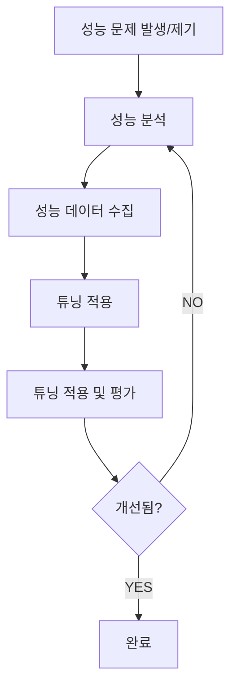

# Part 18. Oracle 성능분석 기본방법론

> 📖 출처: **Oracle SQL 실전 튜닝 나침반** — Part 18 (pp.725~803)
> 📝 정리: 루나 (2026-03-16) / 실습 보강: 유나 (2026-03-24)

---

## 목차

| Section | 제목 | 바로가기 |
|---------|------|---------|
| 01 | 성능 분석 방법론 개요 | [→](#section-01-성능-분석-방법론-개요) |
| 02 | 핵심 성능 데이터 이해 | [→](#section-02-핵심-성능-데이터-이해) |
| 03 | 성능 분석 유틸리티 | [→](#section-03-성능-분석-유틸리티) |
| 04 | 기본적 성능 분석 | [→](#section-04-기본적-성능-분석) |

---

## Section 01. 성능 분석 방법론 개요

### 성능 분석 프로세스 플로우



### 성능 분석 도구

| 도구 | 설명 | 용도 |
|------|------|------|
| **Dynamic Performance View** | 실시간 Database 성능 모니터링 | 현재 상태 파악 |
| **AWR** | Automatic Workload Repository | 성능 통계 자동 수집/보관 |
| **ASH** | Active Session History | 활성 SESSION 캡처 |
| **ADDM** | Automatic Database Diagnostic Monitor | AWR 데이터 분석으로 권장사항 제공 |
| **사용자 정의 스크립트** | DBA 맞춤형 분석 도구 | 특정 상황 분석 |

### 성능 분석 로드맵

1. **Database 기본 성능 분석** — DB 전반적인 성능 지표 수집
2. **성능 문제 위치 파악** — Database vs OS Level 문제인지 판단
3. **분기 분석**
   - **OS 서버 성능 부하 분석**: OS Level 문제일 경우
   - **SQL 시간 구간 성능 비교 분석**: DB Level 문제일 경우 (정상 구간 vs 문제 구간)
4. **상세 분석**
   - **특정 SQL 분석**: SQL 성능 문제 확인 → SQL 튜닝
   - **WAIT EVENT 분석**: 특정 SQL이 아닌 경우 → 하드웨어/인프라 분석
5. **최종 분석 결과 도출** → 튜닝 적용 및 평가

### 성능 튜닝 목표

| 목표 | 설명 |
|------|------|
| **응답시간 최소화** | 쿼리/트랜잭션 완료 시간 단축 |
| **처리량 최대화** | 단위 시간당 트랜잭션/작업 수 증대 |
| **리소스 효율적 사용** | CPU, 메모리, 디스크 I/O 최적화 |
| **잠금 경합 감소** | 다중 사용자 환경에서 동시성 향상 |
| **SQL 실행 계획 최적화** | 최소 리소스로 쿼리 처리 |
| **디스크 I/O 효율화** | 메모리보다 느린 I/O 작업 최소화 |
| **대기 이벤트 효율화** | latch, buffer busy wait, enq 등 병목 방지 |
| **Redo/Undo 생성 최소화** | 과도한 생성으로 인한 성능 저하 방지 |
| **확장성 대비** | 향후 워크로드 증가 대응 |

---

## Section 02. 핵심 성능 데이터 이해

### 1. 시간 모델 — V$SYS_TIME_MODEL

> 📊 **핵심 공식**: `DB_TIME = DB_CPU + Non-Idle Wait Time`

**시간 모델 계층도:**
```
DB TIME
├── DB CPU  
├── sql execute elapsed time
├── parse time elapsed
│   └── hard parse elapsed time
├── PL/SQL execution elapsed time
├── connection management call elapsed time
└── background elapsed time (별도)
```

**주요 통계항목:**

| STAT명 | 설명 |
|--------|------|
| **DB time** | 모든 사용자 프로세스의 총 소진 시간 (WAIT + CPU + I/O). Background 제외. 4개 세션이 10분씩 = DB time 40분 |
| **DB CPU** | 사용자 프로세스의 Oracle 코드 실행 CPU 시간 |
| **sql execute elapsed time** | SQL 수행 시간 (Fetch 포함) |
| **parse time elapsed** | 소프트 + 하드 파싱 시간 |
| **hard parse elapsed time** | 하드 파싱 시간 |
| **PL/SQL execution elapsed time** | PL/SQL 인터프리터 수행 시간 |
| **connection management call elapsed time** | 세션 연결/해제 소요 시간 |
| **background elapsed time** | Background Process 소비 시간 |

**DB_TIME 증가 원인:**
- 시스템 부하 증가 (사용자 수, 콜 수, 트랜잭션 규모 증가)
- I/O 성능 저하 → 대기 시간 증가
- 애플리케이션(SQL) 성능 저하
- CPU 리소스 고갈
- 경합에 의한 대기 시간 증가
- 악성 SQL 증가 / 하드 파싱 증가

#### 🔬 실습: 시간 모델 조회

```sql
-- 현재 시간 모델 통계 조회
SELECT STAT_NAME, ROUND(VALUE / 1000000, 2) AS SECONDS
  FROM V$SYS_TIME_MODEL
 WHERE STAT_NAME IN ('DB time', 'DB CPU', 'sql execute elapsed time',
                     'parse time elapsed', 'hard parse elapsed time',
                     'background elapsed time')
 ORDER BY VALUE DESC;
```

```sql
-- AWR 구간별 시간 모델 DELTA 조회 (최근 2시간)
SELECT A.SNAP_ID,
       TO_CHAR(S.END_INTERVAL_TIME, 'HH24:MI') AS SNAP_TIME,
       ROUND(A.VALUE / 1000000, 2) AS DB_TIME_SEC
  FROM DBA_HIST_SYS_TIME_MODEL A
  JOIN DBA_HIST_SNAPSHOT S ON A.SNAP_ID = S.SNAP_ID AND A.DBID = S.DBID
 WHERE A.STAT_NAME = 'DB time'
   AND S.END_INTERVAL_TIME > SYSDATE - 2/24
 ORDER BY A.SNAP_ID;
```

---

### 2. 시스템 통계 — V$SYSSTAT

**핵심 통계항목:**

| 통계명 | 설명 | 중요도 |
|--------|------|--------|
| **session logical reads** | `db block gets` + `consistent gets`. 총 논리적 읽기 | ⭐⭐⭐ |
| **db block gets** | Current Block 요청 수 (DML 활동) | ⭐⭐⭐ |
| **consistent gets** | 일관성 모드 Block 검색 (읽기 일관성) | ⭐⭐⭐ |
| **physical reads** | 디스크에서 읽은 총 Block 수 | ⭐⭐⭐ |
| **physical reads direct** | 버퍼 캐시 거치지 않은 직접 읽기 | ⭐⭐ |
| **redo size** | 생성된 Redo 데이터 총량 (BYTE) | ⭐⭐⭐ |
| **user commits** | 사용자 commit 수 | ⭐⭐⭐ |
| **user rollbacks** | 사용자 rollback 수 | ⭐⭐ |
| **user calls** | 사용자 호출 수 (로그인, 파싱, Fetch, 실행) | ⭐⭐ |
| **recursive calls** | 내부 SQL 재귀 호출 | ⭐⭐ |
| **execute count** | SQL 실행 총 호출 수 | ⭐⭐⭐ |
| **parse count (total)** | 총 파싱 수 (하드 + 소프트) | ⭐⭐⭐ |
| **parse count (hard)** | 하드 파싱 수 | ⭐⭐⭐ |
| **db block changes** | Block 변경 횟수 | ⭐⭐ |
| **physical writes** | 디스크 쓰기 Block 수 | ⭐⭐ |

**PGA 작업 영역 통계:**

| 통계명 | 설명 |
|--------|------|
| **workarea executions - optimal** | PGA 내에서 처리 완료 (정상) |
| **workarea executions - onepass** | PGA Overflow로 Disk Swapping 1회 발생 |
| **workarea executions - multipass** | PGA Overflow로 Disk Swapping 수회 발생 (심각) |

#### 🔬 실습: 시스템 통계 조회

```sql
-- 핵심 시스템 통계 실시간 조회
SELECT NAME, VALUE
  FROM V$SYSSTAT
 WHERE NAME IN ('session logical reads', 'db block gets', 'consistent gets',
                'physical reads', 'redo size', 'user commits', 'user rollbacks',
                'execute count', 'parse count (total)', 'parse count (hard)')
 ORDER BY NAME;
```

```sql
-- Buffer Cache Hit Ratio 계산
SELECT ROUND(
  (1 - (SELECT VALUE FROM V$SYSSTAT WHERE NAME = 'physical reads')
       / NULLIF((SELECT VALUE FROM V$SYSSTAT WHERE NAME = 'session logical reads'), 0)
  ) * 100, 2) AS "Buffer Cache Hit %"
FROM DUAL;
```

```sql
-- 소프트 파싱 비율 계산
SELECT ROUND(
  (1 - (SELECT VALUE FROM V$SYSSTAT WHERE NAME = 'parse count (hard)')
       / NULLIF((SELECT VALUE FROM V$SYSSTAT WHERE NAME = 'parse count (total)'), 0)
  ) * 100, 2) AS "Soft Parse %"
FROM DUAL;
```

```sql
-- PGA 작업 영역 효율성
SELECT NAME, VALUE,
       ROUND(RATIO_TO_REPORT(VALUE) OVER() * 100, 2) AS PCT
  FROM V$SYSSTAT
 WHERE NAME LIKE 'workarea executions%';
```

---

### 3. 대기 시간 — V$SYSTEM_EVENT

> **핵심**: `DB_TIME = CPU 시간 + 대기 시간`

**WAIT EVENT CLASS 분류:**

| CLASS | 설명 | 주요 대기 이벤트 |
|-------|------|-----------------|
| **Application** | 애플리케이션 부적절한 로직 | `enq: TX - row lock contention` |
| **Concurrency** | 동시 자원 경합 | `latch: cache buffers chains`, `buffer busy waits` |
| **User I/O** | 사용자 I/O | `db file sequential read`, `db file scattered read` |
| **Commit** | Commit 후 Redo Log 쓰기 확인 | `log file sync` |
| **Cluster** | RAC 노드 간 경합 | `gc buffer busy`, `gc cr/current block busy` |
| **System I/O** | Background Process I/O | DBWR wait |
| **Network** | 네트워크 데이터 전송 | `SQL*Net message from client` |
| **Configuration** | DB/Instance 부적절한 구성 | 로그 파일, 공유 풀 사이즈 문제 |
| **Administrative** | DBA 명령에 의한 대기 | |
| **Idle** | 비활성 SESSION 대기 | `SQL*Net message from client` |

### 주요 WAIT EVENT 상세

#### Application Class

| WAIT EVENT | 설명 | 해결 방안 |
|------------|------|----------|
| **enq: TX - row lock contention** | 다른 세션이 잠근 행을 수정하려 할 때 | Lock 경합 최소화, 트랜잭션 짧게 |
| **enq: TM - contention** | 테이블 수준 잠금 경합 (DDL vs DML) | DDL은 비활성 시간에 스케줄링 |

#### Concurrency Class

| WAIT EVENT | 설명 | 해결 방안 |
|------------|------|----------|
| **latch: cache buffers chains** | 동일 Block 동시 접근 시 래치 경합 (Hot Block) | 비효율적 SQL 튜닝으로 핫 Block 접근 줄이기 |
| **latch: shared pool** | Shared Pool 동시 할당 경합 (하드 파싱 빈번) | 바인드 변수로 소프트 파싱 유도 |
| **enq: TX - index contention** | INDEX Block Split 경합 | HASH 파티셔닝, INDEX 순서 변경 |
| **library cache lock** | Library Cache 객체 접근 경합 | DDL 줄이고, 바인드 변수 사용 |
| **cursor: pin S wait on X** | 동일 커서 경합 (하드 파싱 관련) | 바인드 변수 처리, 소프트 파싱 |
| **buffer busy waits** | 동일 Block 읽기/수정 경합 (HOT Block) | SQL 튜닝, HASH 파티셔닝으로 분산 |

#### User I/O Class

| WAIT EVENT | 설명 | 해결 방안 |
|------------|------|----------|
| **db file sequential read** | INDEX RANGE SCAN 등 Single Block I/O | SQL 튜닝으로 불필요한 I/O 최소화 |
| **db file scattered read** | FULL TABLE SCAN 등 Multi Block I/O | 비효율적 FULL SCAN 최소화 |
| **direct path read** | 버퍼 캐시 거치지 않는 직접 읽기 | SQL 튜닝, 파티셔닝으로 SCAN 감소 |
| **direct path read temp** | TEMP TABLESPACE 읽기 (SORT, HASH JOIN) | 정렬/JOIN 최적화로 TEMP 사용 감소 |
| **direct path write** | 버퍼 캐시 거치지 않는 직접 쓰기 (APPEND 힌트) | — |
| **read by other session** | 다른 세션이 읽는 Block 대기 | SQL 튜닝으로 동일 Block 접근 줄이기 |

#### Cluster Class (RAC)

| WAIT EVENT | 설명 | 해결 방안 |
|------------|------|----------|
| **gc buffer busy** | Global 버전의 buffer busy wait (HOT Block) | HASH 파티셔닝, 같은 Node에서 수행, SQL 튜닝 |
| **gc cr/current block busy** | Block 인터커넥트 전송 경합 | DML은 같은 Node에서 수행 |

#### 🔬 실습: WAIT EVENT 분석

```sql
-- Top 10 Non-Idle WAIT EVENT (현재)
SELECT EVENT, WAIT_CLASS,
       TOTAL_WAITS,
       ROUND(TIME_WAITED / 100, 2) AS TIME_WAITED_SEC,
       ROUND(AVERAGE_WAIT * 10, 2) AS AVG_WAIT_MS
  FROM V$SYSTEM_EVENT
 WHERE WAIT_CLASS <> 'Idle'
 ORDER BY TIME_WAITED DESC
 FETCH FIRST 10 ROWS ONLY;
```

```sql
-- WAIT EVENT CLASS별 대기 시간 비율
SELECT WAIT_CLASS,
       SUM(TOTAL_WAITS) AS TOTAL_WAITS,
       ROUND(SUM(TIME_WAITED) / 100, 2) AS TOTAL_SEC,
       ROUND(RATIO_TO_REPORT(SUM(TIME_WAITED)) OVER() * 100, 2) AS PCT
  FROM V$SYSTEM_EVENT
 WHERE WAIT_CLASS NOT IN ('Idle')
 GROUP BY WAIT_CLASS
 ORDER BY TOTAL_SEC DESC;
```

---

### 4. CPU 사용률 — V$OSSTAT

```sql
-- CPU 사용률 계산 공식
CPU 사용률 = BUSY_TIME / (IDLE_TIME + BUSY_TIME) * 100
```

| OSSTAT | 설명 |
|--------|------|
| **NUM_CPUS** | 사용 중인 CPU 수 |
| **BUSY_TIME** | busy 상태 CPU 시간 = USER_TIME + SYS_TIME |
| **IDLE_TIME** | idle 상태 CPU 시간 |
| **USER_TIME** | user code 실행 CPU 시간 |
| **SYS_TIME** | kernel code 실행 CPU 시간 |
| **IOWAIT_TIME** | I/O 대기 시간 |

> ⚠️ 누적값이므로 **현재 값 - 이전 값 = DELTA**로 구간 사용률 계산 필요
> ⚠️ 일반적으로 USER_TIME > SYS_TIME이어야 정상. SYS_TIME이 지속 증가하면 OS Level 점검 필요

#### 🔬 실습: CPU 사용률 조회

```sql
-- 현재 CPU 사용률
SELECT ROUND(
  (SELECT VALUE FROM V$OSSTAT WHERE STAT_NAME = 'BUSY_TIME')
  / NULLIF(
    (SELECT VALUE FROM V$OSSTAT WHERE STAT_NAME = 'BUSY_TIME')
    + (SELECT VALUE FROM V$OSSTAT WHERE STAT_NAME = 'IDLE_TIME'), 0)
  * 100, 2) AS "CPU Usage %"
FROM DUAL;
```

```sql
-- CPU 상세 통계
SELECT STAT_NAME, VALUE,
       CASE WHEN STAT_NAME IN ('BUSY_TIME','IDLE_TIME','USER_TIME','SYS_TIME','IOWAIT_TIME')
            THEN ROUND(VALUE / 100, 2)
       END AS SECONDS
  FROM V$OSSTAT
 WHERE STAT_NAME IN ('NUM_CPUS','BUSY_TIME','IDLE_TIME','USER_TIME','SYS_TIME','IOWAIT_TIME');
```

---

### 5. SQL 성능 — V$SQL

**핵심 컬럼:**

| 컬럼명 | 설명 |
|--------|------|
| **SQL_ID** | SQL 식별자 (문장에 종속, 변경 시 변경됨) |
| **PLAN_HASH_VALUE** | 실행계획에 종속적인 값 (계획 변경 시 변경됨) |
| **EXECUTIONS** | SQL 실행 수 |
| **BUFFER_GETS** | 논리적 I/O 발생량 (Block 수) |
| **DISK_READS** | 물리적 I/O 발생량 (Block 수) |
| **ELAPSED_TIME** | SQL 수행 시간 (마이크로초, 1/1,000,000) |
| **CPU_TIME** | SQL 사용 CPU 시간 (마이크로초) |
| **ROWS_PROCESSED** | SQL 반환 총 행 수 |
| **APPLICATION_WAIT_TIME** | Application(Lock) 대기시간 |
| **CONCURRENCY_WAIT_TIME** | Concurrency 대기시간 |
| **USER_IO_WAIT_TIME** | User I/O 대기시간 |
| **CLUSTER_WAIT_TIME** | Cluster 대기시간 |
| **CHILD_NUMBER** | Child Cursor 번호 (너무 높으면 점검 필요) |
| **IS_BIND_SENSITIVE** | 바인드 값에 따라 다른 실행계획 생성 가능 여부 |
| **IS_BIND_AWARE** | 확장된 커서 공유 사용 여부 |

#### 🔬 실습: TOP SQL 분석

```sql
-- Top 10 SQL by Elapsed Time
SELECT SQL_ID, PLAN_HASH_VALUE,
       EXECUTIONS,
       ROUND(ELAPSED_TIME / 1000000, 2) AS ELAPSED_SEC,
       ROUND(CPU_TIME / 1000000, 2) AS CPU_SEC,
       BUFFER_GETS,
       DISK_READS,
       ROWS_PROCESSED,
       ROUND(BUFFER_GETS / NULLIF(EXECUTIONS, 0)) AS GETS_PER_EXEC,
       SUBSTR(SQL_TEXT, 1, 60) AS SQL_TEXT
  FROM V$SQL
 WHERE EXECUTIONS > 0
 ORDER BY ELAPSED_TIME DESC
 FETCH FIRST 10 ROWS ONLY;
```

```sql
-- Top 10 SQL by Buffer Gets (논리적 I/O)
SELECT SQL_ID, PLAN_HASH_VALUE,
       EXECUTIONS,
       BUFFER_GETS,
       ROUND(BUFFER_GETS / NULLIF(EXECUTIONS, 0)) AS GETS_PER_EXEC,
       ROUND(ELAPSED_TIME / 1000000, 2) AS ELAPSED_SEC,
       SUBSTR(SQL_TEXT, 1, 60) AS SQL_TEXT
  FROM V$SQL
 WHERE EXECUTIONS > 0
 ORDER BY BUFFER_GETS DESC
 FETCH FIRST 10 ROWS ONLY;
```

---

### 6. ASH (Active Session History)

> 📊 **ASH 아키텍처**: V$SESSION(1초 샘플링) → V$ACTIVE_SESSION_HISTORY(메모리, 순환버퍼) → DBA_HIST_ACTIVE_SESS_HISTORY(디스크, AWR)

- **V$SESSION**에서 **1초 단위**로 정보 Sample 추출 (SQL 사용 안 함)
- AWR 수집 주기마다 MMON Process에 의해 **1/10 비율로** 디스크 저장
- ASH 메모리는 **Shared Pool의 5%** 또는 SGA_TARGET의 5% 초과 불가

**주요 Sampling 데이터:** SQL_ID, 객체 번호, 파일/Block 번호, SESSION 식별자, 모듈, 프로그램, 대기 이벤트 식별자, 트랜잭션 ID, PGA/TEMP 사용량

**핵심 컬럼:**

| 컬럼명 | 설명 |
|--------|------|
| **SAMPLE_TIME** | 활동 기록 시간 |
| **SESSION_ID / SESSION_SERIAL#** | 세션 고유 식별 |
| **SQL_ID** | 실행 중인 SQL 식별자 |
| **SQL_PLAN_HASH_VALUE** | 실행 계획 해시 값 |
| **EVENT** | 대기 중인 이벤트 |
| **WAIT_CLASS** | 대기 이벤트 클래스 |
| **WAIT_TIME** | 이벤트 대기 시간 (마이크로초) |
| **SESSION_STATE** | ON CPU / WAITING / IDLE |
| **BLOCKING_SESSION** | 차단 세션 ID |
| **CURRENT_OBJ#** | 현재 작업 중인 객체 ID |
| **SQL_PLAN_OPERATION** | 실행계획 작업명 |
| **IN_HARD_PARSE** | 하드 파싱 중 여부 |
| **IN_SQL_EXECUTION** | SQL 실행 중 여부 |

#### 🔬 실습: ASH 분석

```sql
-- 최근 5분간 Top SQL (ASH)
SELECT SQL_ID,
       COUNT(*) AS SAMPLE_CNT,
       ROUND(COUNT(*) * 100 / SUM(COUNT(*)) OVER(), 2) AS PCT,
       MAX(EVENT) AS TOP_EVENT,
       MAX(WAIT_CLASS) AS TOP_WAIT_CLASS
  FROM V$ACTIVE_SESSION_HISTORY
 WHERE SAMPLE_TIME > SYSDATE - 5/1440
   AND SQL_ID IS NOT NULL
 GROUP BY SQL_ID
 ORDER BY SAMPLE_CNT DESC
 FETCH FIRST 10 ROWS ONLY;
```

```sql
-- 최근 10분간 WAIT EVENT 분포 (ASH)
SELECT NVL(EVENT, 'ON CPU') AS EVENT,
       NVL(WAIT_CLASS, 'CPU') AS WAIT_CLASS,
       COUNT(*) AS SAMPLE_CNT,
       ROUND(COUNT(*) * 100 / SUM(COUNT(*)) OVER(), 2) AS PCT
  FROM V$ACTIVE_SESSION_HISTORY
 WHERE SAMPLE_TIME > SYSDATE - 10/1440
 GROUP BY EVENT, WAIT_CLASS
 ORDER BY SAMPLE_CNT DESC
 FETCH FIRST 10 ROWS ONLY;
```

```sql
-- Blocking Session 확인 (현재 Lock 경합)
SELECT SESSION_ID, SQL_ID, EVENT, BLOCKING_SESSION,
       SAMPLE_TIME
  FROM V$ACTIVE_SESSION_HISTORY
 WHERE BLOCKING_SESSION IS NOT NULL
   AND SAMPLE_TIME > SYSDATE - 5/1440
 ORDER BY SAMPLE_TIME DESC
 FETCH FIRST 20 ROWS ONLY;
```

---

### 7. AWR (Automatic Workload Repository)

> 📊 **AWR 아키텍처**: MMON 프로세스가 주기적(기본 60분)으로 메모리 통계를 SYSAUX Tablespace에 스냅샷 저장

- 성능 통계를 **디스크에 주기적으로 저장**하는 서비스
- MMON Process에 의해 메모리 통계가 디스크로 전송
- 기본 **1시간 단위** SNAPSHOT, 최소 **10분 단위**까지 조정 가능
- **정확한 분석을 위해 10분 단위 수집 권고**

**주요 AWR 딕셔너리 뷰:**

| AWR 뷰 | 원본 뷰 | 설명 |
|---------|---------|------|
| **DBA_HIST_SNAPSHOT** | — | SNAPSHOT 시간 정보 관리 |
| **DBA_HIST_SQLSTAT** | GV$SQL | SQL 성능 통계 |
| **DBA_HIST_OSSTAT** | GV$OSSTAT | OS 성능 통계 |
| **DBA_HIST_SYS_TIME_MODEL** | GV$SYS_TIME_MODEL | 시간 모델 통계 |
| **DBA_HIST_SYSSTAT** | GV$SYSSTAT | 시스템 통계 |
| **DBA_HIST_SYSTEM_EVENT** | GV$SYSTEM_EVENT | 대기 시간 통계 |
| **DBA_HIST_ACTIVE_SESS_HISTORY** | GV$ACTIVE_SESSION_HISTORY | ASH 1/10 Sampling |

**ASH vs AWR 데이터 차이:**

| 항목 | ASH (GV$) | AWR (DBA_HIST_) |
|------|-----------|-----------------|
| **보관기간** | ASH Buffer 크기 (짧음) | 약 일주일 (설정 변경 가능) |
| **정확도** | 1:1 실제값 | 1/10 Sampling (*10 필요) |
| **분석범위** | 단기간 상세 분석 | 장기간 Trend 분석 |

#### 🔬 실습: AWR 스냅샷 관리

```sql
-- AWR 스냅샷 목록 조회 (최근 24시간)
SELECT SNAP_ID,
       TO_CHAR(BEGIN_INTERVAL_TIME, 'MM-DD HH24:MI') AS BEGIN_TIME,
       TO_CHAR(END_INTERVAL_TIME, 'MM-DD HH24:MI') AS END_TIME,
       SNAP_LEVEL
  FROM DBA_HIST_SNAPSHOT
 WHERE END_INTERVAL_TIME > SYSDATE - 1
 ORDER BY SNAP_ID;
```

```sql
-- AWR 수집 주기를 10분으로 변경 (보관기간 7일)
BEGIN
  DBMS_WORKLOAD_REPOSITORY.MODIFY_SNAPSHOT_SETTINGS(
    retention => 7 * 24 * 60,   -- 7일 (분 단위)
    interval  => 10              -- 10분 (분 단위)
  );
END;
/
```

```sql
-- 수동 스냅샷 생성
BEGIN
  DBMS_WORKLOAD_REPOSITORY.CREATE_SNAPSHOT;
END;
/
```

---

## Section 03. 성능 분석 유틸리티

### AWR Report

**생성 권한:**
```sql
GRANT EXECUTE ON DBMS_WORKLOAD_REPOSITORY TO username;
GRANT ADVISOR TO username;
```

**생성 방법 — 스크립트:**
```sql
SELECT OUTPUT
  FROM (SELECT INSTANCE_NUMBER, DBID,
               MIN(SNAP_ID) MIN_SNAP_ID,
               MAX(SNAP_ID) MAX_SNAP_ID
          FROM SYS.DBA_HIST_SNAPSHOT
         WHERE END_INTERVAL_TIME >= TO_DATE('20230316 1400', 'YYYYMMDD HH24MI')
           AND END_INTERVAL_TIME <  TO_DATE('20230316 1450', 'YYYYMMDD HH24MI')
           AND INSTANCE_NUMBER = 1
         GROUP BY INSTANCE_NUMBER, DBID),
       TABLE(DBMS_WORKLOAD_REPOSITORY.AWR_REPORT_HTML(
             DBID, INSTANCE_NUMBER, MIN_SNAP_ID, MAX_SNAP_ID));
```

**AWR Report 주요 섹션:**

| 섹션 | 설명 | 중요도 |
|------|------|--------|
| **Report Summary** | DB 기본 정보, Load Profile, Instance Efficiency | ⭐⭐⭐ |
| **Instance Efficiency** | 버퍼 히트율, 파싱 효율성 등 | ⭐⭐⭐ |
| **Top 10 Foreground Events** | 상위 대기 이벤트 | ⭐⭐⭐ |
| **Time Model Statistics** | 시간별 Database 활동 | ⭐⭐⭐ |
| **SQL ordered by Elapsed Time** | 수행시간 기준 TOP SQL | ⭐⭐⭐ |
| **SQL ordered by CPU Time** | CPU 시간 기준 TOP SQL | ⭐⭐⭐ |
| **SQL ordered by Buffer Gets** | 논리적 I/O 기준 TOP SQL | ⭐⭐⭐ |
| **IO Statistics** | I/O 활동 분석 | ⭐⭐ |
| **Advisory Statistics** | 메모리/복구 매개변수 최적화 권고 | ⭐⭐ |

**Instance Efficiency 목표값:**

| 지표 | 목표 | 설명 |
|------|------|------|
| **Buffer Nowait %** | 100% | 버퍼 대기 없이 접근한 비율 |
| **Buffer Hit %** | 99%+ | 버퍼 캐시에서 데이터 조회 비율 |
| **Redo NoWait %** | 100% | Redo 로그 대기 없이 접근 비율 |
| **In-memory Sort %** | 100% | 메모리 내 정렬 비율 |
| **Soft Parse %** | 95%+ | 소프트 파싱 비율 |
| **Execute to Parse %** | 80%+ | 파싱 없이 실행된 비율 |
| **Latch Hit %** | 99%+ | 래치 대기 없이 접근한 비율 |
| **% Non-Parse CPU** | 높을수록 | CPU 중 파싱 제외 비율 |

> 📌 **저자 의견**: AWR Report만으로는 빠른 문제 파악이 어려움. **정상 구간과의 비교 + Trend 데이터**가 필요. 직접 Script를 만들어 사용하는 것을 권장.

---

### ASH Report

- V$ACTIVE_SESSION_HISTORY 데이터 기반
- **특정 시간 구간**의 활성 세션 활동 분석에 유용

**생성 방법:**
```sql
SELECT OUTPUT
  FROM (SELECT INSTANCE_NUMBER, DBID
          FROM SYS.DBA_HIST_SNAPSHOT
         WHERE INSTANCE_NUMBER = 1 AND ROWNUM <= 1),
       TABLE(DBMS_WORKLOAD_REPOSITORY.ASH_REPORT_HTML(
             DBID, INSTANCE_NUMBER,
             TO_DATE('20230316 1420', 'YYYYMMDD HH24MI'),
             TO_DATE('20230316 1425', 'YYYYMMDD HH24MI'),
             0, 60));
```

**주요 섹션:**

| 섹션 | 설명 |
|------|------|
| **Top Service/Module** | 서비스/모듈별 부하 분포 |
| **Top SQL with Top Events** | 대기 이벤트와 함께 TOP SQL |
| **Top Sessions** | 가장 많은 부하 생성 SESSION |
| **Top Blocking Sessions** | 다른 SESSION을 차단하는 SESSION |
| **Top DB Objects** | 가장 많은 대기 생성 객체 |
| **Activity Over Time** | 시간대별 활동 분석 |

---

### ADDM Report

- AWR 데이터를 분석하여 **자동으로 성능 문제 식별**
- 구체적인 **권장사항과 예상 개선 효과** 제공
- TOP SQL 및 시스템 리소스 병목 분석

**생성 방법:**
```sql
-- ADDM 분석 실행
DECLARE
  V_TASK_NAME    VARCHAR2(60);
  N_DBID         NUMBER;
  N_INST_ID      NUMBER;
  N_ST_SNAP_ID   NUMBER;
  N_ED_SNAP_ID   NUMBER;
BEGIN
  SELECT DBID, INSTANCE_NUMBER, MIN(SNAP_ID), MAX(SNAP_ID)
    INTO N_DBID, N_INST_ID, N_ST_SNAP_ID, N_ED_SNAP_ID
    FROM SYS.DBA_HIST_SNAPSHOT
   WHERE END_INTERVAL_TIME >= TO_DATE('20230316 1400', 'YYYYMMDD HH24MI')
     AND END_INTERVAL_TIME <  TO_DATE('20230316 1430', 'YYYYMMDD HH24MI')
     AND INSTANCE_NUMBER = 1
   GROUP BY INSTANCE_NUMBER, DBID;

  DBMS_ADDM.ANALYZE_INST(V_TASK_NAME, N_ST_SNAP_ID, N_ED_SNAP_ID,
                          N_INST_ID, N_DBID);
END;
/
```

```sql
-- ADDM Report 출력
SELECT DBMS_ADDM.GET_REPORT(TASK_NAME) AS REPORT
  FROM (SELECT TASK_NAME
          FROM USER_ADDM_TASKS
         ORDER BY LAST_MODIFIED DESC)
 WHERE ROWNUM <= 1;
```

---

## Section 04. 기본적 성능 분석

### 성능 문제 및 장애 발생 전 징후

| 징후 | 설명 | 연계 분석 |
|------|------|----------|
| **CPU 사용률 증가** | Session Logical Reads, DB_TIME, SQL 실행 시간, DB_CPU 동반 증가 | SYS_TIME만 증가 시 OS Level 점검 |
| **DB_TIME 증가** | DB_TIME = CPU 시간 + 대기 시간. DB 부하 증가의 직접 지표 | DB_CPU 증가 없으면 WAIT EVENT 분석 |
| **WAIT EVENT 대기 시간 증가** | 특정 또는 동시다발적 WAIT EVENT 급증 | CLASS별 → 개별 EVENT 분석 |
| **ACTIVE SESSION 수 증가** | 악성 SQL, WAIT EVENT 급증, BUG 등 | 즉시 원인 파악 필요 (장애 전조) |
| **Redo/Undo 생성량 증가** | log file sync 증가, 아카이브 로그 급증 | 과도한 DML 확인 |
| **하드 파싱 증가** | CPU/메모리 부담 | 바인드 변수 사용으로 해결 |
| **TEMP TABLESPACE 경합** | 대량 SORT, HASH JOIN 시 TEMP FULL | SQL 최적화로 TEMP 사용 감소 |

---

### 기본 성능 분석 Trend

> ⚠️ DBA_HIST_OSSTAT, DBA_HIST_SYS_TIME_MODEL, DBA_HIST_SYSSTAT의 값은 **누적값**이므로 **DELTA** 계산 필요

**성능 지표 간 상관관계:**

```
CPU 사용률 증가 → DB_TIME ↑, DB_CPU ↑, SQL시간 ↑, Session Logical I/O ↑

DB_CPU 증가 없이 DB_TIME만 증가
  → DB_TIME = DB_CPU + 대기시간 → 대기 시간 증가 → WAIT EVENT 연계 분석

CPU 사용률 증가, BUT I/O·DB_TIME·DB_CPU 변화 없음
  → DB Level 문제 아님 → OS Level 점검 필요 (SYS_TIME 확인)
```

#### 🔬 실습: 기본 성능 Trend 조회

```sql
-- 10분 단위 CPU + DB_TIME + SQL Logical I/O Trend (최근 2시간)
SELECT S.SNAP_ID,
       TO_CHAR(S.END_INTERVAL_TIME, 'HH24:MI') AS SNAP_TIME,
       -- CPU 사용률
       ROUND((O_BUSY.VALUE - LAG(O_BUSY.VALUE) OVER(ORDER BY S.SNAP_ID))
           / NULLIF((O_BUSY.VALUE - LAG(O_BUSY.VALUE) OVER(ORDER BY S.SNAP_ID))
                  + (O_IDLE.VALUE - LAG(O_IDLE.VALUE) OVER(ORDER BY S.SNAP_ID)), 0)
           * 100, 2) AS CPU_PCT,
       -- DB_TIME (초)
       ROUND((T.VALUE - LAG(T.VALUE) OVER(ORDER BY S.SNAP_ID)) / 1000000, 2) AS DB_TIME_SEC,
       -- Session Logical Reads
       (SS.VALUE - LAG(SS.VALUE) OVER(ORDER BY S.SNAP_ID)) AS LOGICAL_READS
  FROM DBA_HIST_SNAPSHOT S
  JOIN DBA_HIST_OSSTAT O_BUSY ON S.SNAP_ID = O_BUSY.SNAP_ID AND S.DBID = O_BUSY.DBID
       AND O_BUSY.STAT_NAME = 'BUSY_TIME'
  JOIN DBA_HIST_OSSTAT O_IDLE ON S.SNAP_ID = O_IDLE.SNAP_ID AND S.DBID = O_IDLE.DBID
       AND O_IDLE.STAT_NAME = 'IDLE_TIME'
  JOIN DBA_HIST_SYS_TIME_MODEL T ON S.SNAP_ID = T.SNAP_ID AND S.DBID = T.DBID
       AND T.STAT_NAME = 'DB time'
  JOIN DBA_HIST_SYSSTAT SS ON S.SNAP_ID = SS.SNAP_ID AND S.DBID = SS.DBID
       AND SS.STAT_NAME = 'session logical reads'
 WHERE S.END_INTERVAL_TIME > SYSDATE - 2/24
   AND S.INSTANCE_NUMBER = 1
 ORDER BY S.SNAP_ID;
```

---

### WAIT EVENT 성능 Trend

**분석 흐름:**
1. WAIT EVENT **CLASS** 레벨 Trend 확인
2. 특정 CLASS 내 **개별 WAIT EVENT** 시간 구간 비교
3. 문제 WAIT EVENT의 **상세 Trend** 확인

```sql
-- 평균 대기시간 계산
평균_대기시간(ms) = TIME_WAITED_MICRO / TOTAL_WAITS / 1000
```

**WAIT EVENT 성능 기준:**

| 이벤트 | 정상 기준 | 주의 |
|--------|-----------|------|
| **log file sync** | < 10ms | Redo Log Disk 성능 이슈 |
| **db file sequential read** | < 10ms | Single Block I/O 성능 |
| **db file scattered read** | < 10ms | Multi Block I/O 성능 |

#### 🔬 실습: WAIT EVENT Trend 분석

```sql
-- WAIT EVENT CLASS별 10분 단위 Trend (최근 2시간)
SELECT S.SNAP_ID,
       TO_CHAR(S.END_INTERVAL_TIME, 'HH24:MI') AS SNAP_TIME,
       E.WAIT_CLASS,
       (E.TOTAL_WAITS - LAG(E.TOTAL_WAITS) OVER(PARTITION BY E.WAIT_CLASS ORDER BY S.SNAP_ID)) AS DELTA_WAITS,
       ROUND((E.TIME_WAITED_MICRO - LAG(E.TIME_WAITED_MICRO) OVER(PARTITION BY E.WAIT_CLASS ORDER BY S.SNAP_ID))
           / NULLIF((E.TOTAL_WAITS - LAG(E.TOTAL_WAITS) OVER(PARTITION BY E.WAIT_CLASS ORDER BY S.SNAP_ID)), 0)
           / 1000, 2) AS AVG_WAIT_MS
  FROM DBA_HIST_SNAPSHOT S
  JOIN DBA_HIST_SYSTEM_EVENT E ON S.SNAP_ID = E.SNAP_ID AND S.DBID = E.DBID
 WHERE S.END_INTERVAL_TIME > SYSDATE - 2/24
   AND E.WAIT_CLASS NOT IN ('Idle')
   AND S.INSTANCE_NUMBER = 1
 ORDER BY S.SNAP_ID, E.WAIT_CLASS;
```

---

### SQL 성능 분석

**DBA_HIST_SQLSTAT 주요 컬럼:**

| 컬럼 | 설명 |
|------|------|
| SQL_ID | SQL 식별자 |
| PLAN_HASH_VALUE | 실행 계획 식별자 |
| PARSING_SCHEMA_NAME | 수행 스키마명 |
| EXECUTIONS_DELTA | 실행 수 |
| ROWS_PROCESSED_DELTA | 결과 건수 |
| BUFFER_GETS_DELTA | 논리적 I/O (Block) |
| DISK_READS_DELTA | 물리적 I/O (Block) |
| ELAPSED_TIME_DELTA | 수행 시간 (μs) |
| CPU_TIME_DELTA | CPU 시간 (μs) |
| IOWAIT_DELTA | User I/O 대기 시간 (μs) |
| CCWAIT_DELTA | Concurrency 대기 시간 (μs) |
| CLWAIT_DELTA | Cluster 대기 시간 (μs) |
| DIRECT_WRITES_DELTA | TEMP TABLESPACE WRITE 수 |

**분석 포인트:**
1. **TOP SQL 자원 점유율** 분석
2. **시간 구간별 SQL 비교** (정상 vs 문제 구간)
3. **SQL 실행 패턴 변화** 확인
4. **일주일 전 동일 구간 대비** 자원 사용률 비교

#### 🔬 실습: SQL 구간 비교 분석

```sql
-- 특정 시간 구간의 Top SQL 비교 (정상 vs 문제 구간)
-- 스냅샷 ID를 먼저 확인 후, 정상/문제 구간 SNAP_ID 대입
SELECT SQL_ID, PARSING_SCHEMA_NAME,
       SUM(EXECUTIONS_DELTA) AS EXEC_CNT,
       ROUND(SUM(ELAPSED_TIME_DELTA) / 1000000, 2) AS ELAPSED_SEC,
       ROUND(SUM(CPU_TIME_DELTA) / 1000000, 2) AS CPU_SEC,
       SUM(BUFFER_GETS_DELTA) AS BUFFER_GETS,
       SUM(DISK_READS_DELTA) AS DISK_READS,
       ROUND(SUM(BUFFER_GETS_DELTA) / NULLIF(SUM(EXECUTIONS_DELTA), 0)) AS GETS_PER_EXEC
  FROM DBA_HIST_SQLSTAT
 WHERE SNAP_ID BETWEEN &start_snap AND &end_snap
   AND DBID = (SELECT DBID FROM V$DATABASE)
 GROUP BY SQL_ID, PARSING_SCHEMA_NAME
 ORDER BY ELAPSED_SEC DESC
 FETCH FIRST 20 ROWS ONLY;
```

---

### ASH TREND & TOP 5 WAIT EVENT

#### 🔬 실습: ASH 기반 분석

```sql
-- 1분 단위 Active Session Trend (최근 30분)
SELECT TO_CHAR(TRUNC(SAMPLE_TIME, 'MI'), 'HH24:MI') AS MIN_TIME,
       COUNT(*) AS ACTIVE_SESSIONS,
       SUM(CASE WHEN SESSION_STATE = 'ON CPU' THEN 1 ELSE 0 END) AS ON_CPU,
       SUM(CASE WHEN SESSION_STATE = 'WAITING' THEN 1 ELSE 0 END) AS WAITING
  FROM V$ACTIVE_SESSION_HISTORY
 WHERE SAMPLE_TIME > SYSDATE - 30/1440
 GROUP BY TRUNC(SAMPLE_TIME, 'MI')
 ORDER BY MIN_TIME;
```

```sql
-- 10분 단위 Top 5 WAIT EVENT Trend (AWR ASH, 최근 6시간)
SELECT TO_CHAR(TRUNC(SAMPLE_TIME, 'HH24'), 'MM-DD HH24') || ':' ||
       LPAD(TRUNC(EXTRACT(MINUTE FROM SAMPLE_TIME) / 10) * 10, 2, '0') AS TIME_SLOT,
       NVL(EVENT, 'ON CPU') AS EVENT,
       COUNT(*) * 10 AS EST_ACTIVE_SECS
  FROM DBA_HIST_ACTIVE_SESS_HISTORY
 WHERE SAMPLE_TIME > SYSDATE - 6/24
   AND (EVENT IS NULL OR WAIT_CLASS <> 'Idle')
 GROUP BY TRUNC(SAMPLE_TIME, 'HH24'),
          TRUNC(EXTRACT(MINUTE FROM SAMPLE_TIME) / 10),
          EVENT
 ORDER BY TIME_SLOT, EST_ACTIVE_SECS DESC;
```

---

### 트랜잭션 및 I/O 성능 통계

**주요 모니터링 지표:**

| 지표 | 정상 기준 | 이상 신호 |
|------|-----------|-----------|
| **트랜잭션 처리 성능** | log file sync < 10ms | 평균 대기시간 급증 |
| **Redo 생성량** | 적정 수준 | 10분당 20GB+ 과도한 생성 |
| **I/O 평균 대기시간** | < 10ms | Storage 성능 이슈 |

---

## 📊 실무 성능 분석 프로세스 (정리)

```
① 기본 성능 Trend 확인 (CPU, DB_TIME, SQL 시간)
    ↓ 급증/점진적 증가 발견
② 이상 구간 식별 (정상 구간과 비교)
    ↓
③ WAIT EVENT Trend 분석 (어떤 대기 이벤트 증가?)
    ↓
④ TOP SQL 분석 (어떤 SQL이 부하 증가?)
    ↓
⑤ ASH 상세 분석 (1초 단위 정밀 분석)
    ↓
⑥ SQL 튜닝 또는 인프라 조치
```

---

## 핵심 체크리스트 ✅

1. **DB_TIME = CPU 시간 + 대기 시간** — 성능 분석의 기본 공식
2. **성능 분석은 Trend + 비교** — 정상 구간 대비 문제 구간 비교가 핵심
3. **Top Down 분석** — 시간 모델 → WAIT EVENT CLASS → 개별 EVENT → SQL
4. **AWR 10분 단위** 수집 권고 — 정확한 분석 위해
5. **누적값 주의** — DELTA 계산 필수 (현재 - 이전)
6. **CPU 사용률 증가 시** — DB Level인지 OS Level인지 먼저 판별
7. **WAIT EVENT 급증** — 특정 SQL? 하드웨어? BUG? 원인 추적
8. **하드 파싱 증가** — 바인드 변수 사용으로 소프트 파싱 유도
9. **ACTIVE SESSION 급증** — 즉시 원인 파악 필요 (장애 전조)
10. **직접 Script 작성 활용** — AWR Report보다 정형화된 Trend 분석이 빠름

---

## ⚠️ 성능 장애 예방 Tips

- **정기적 TOP SQL 모니터링** → 자원 점유율 높은 SQL 사전 튜닝
- **과거 동일 구간 대비** 성능 변화량 추적
- **평균 대기시간** 지속 모니터링 (특히 log file sync, I/O 관련)
- **하드 파싱률** 추적 → 바인드 변수 적용
- **TEMP TABLESPACE 사용률** 모니터링
